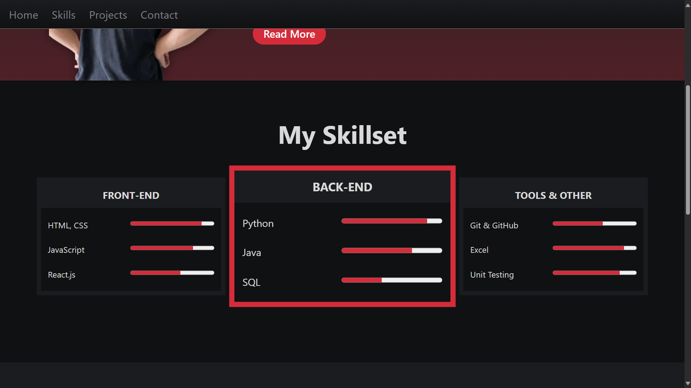
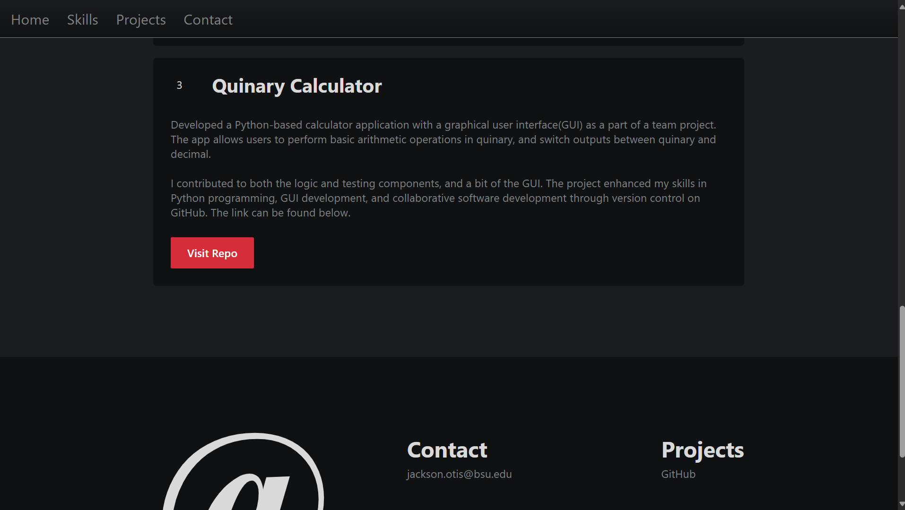

# Portfolio Project

This is a portfolio project for CS311 - Web and Mobile Development at Ball State University

## Table of Contents

- [Overview](#overview)
- [Features](#features)
- [Technologies Used](#technologies-used)
- [Screenshots](#screenshots)

## Overview

This project showcases web and mobile development skills, including responsive design, interactivity, slight silliness, and modern frameworks.

## Features

- Responsive web design
- Mobile-friendly interface
- Interactive components
- Clean and modular codebase

## Technologies Used

- HTML5, CSS3

## Screenshots

