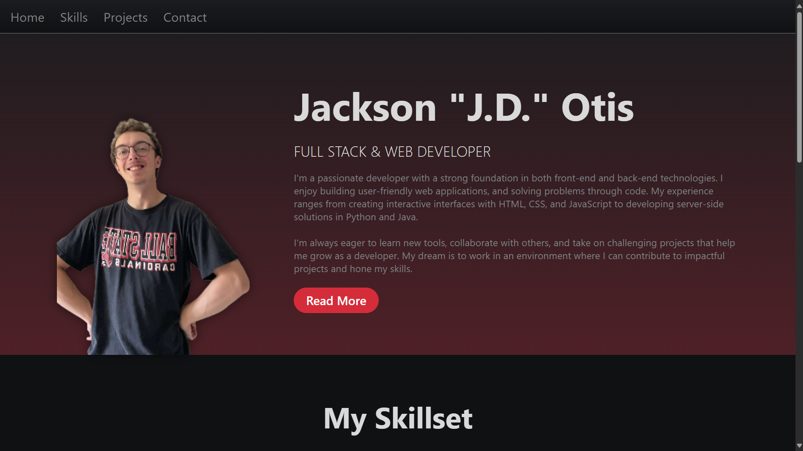

# Portfolio Project

This is a portfolio project for CS311 - Web and Mobile Development at Ball State University

## Table of Contents

- [Overview](#overview)
- [Features](#features)
- [Technologies Used](#technologies-used)
- [Typewriter Effect](#typewriter-effect)
- [Screenshots](#screenshots)

## Overview

This project showcases web and mobile development skills, including responsive design, interactivity, and slight silliness.

## Features

- Responsive web design
- Mobile-friendly interface
- Interactive components
- Animated typewriter effect
- Clean and modular codebase

## Technologies Used

- HTML, CSS
- JavaScript
- CSS Animations & Keyframes

## Typewriter Effect

The portfolio features an animated typewriter effect on the main heading that:

- Cycles through multiple titles
- Has realistic typing & backspacing speeds with one-by-one character animation
- Has blinking cursor effect using CSS animations
- Continuously loops
- Uses the site's accent color theme for consistency

The effect is implemented with vanilla JavaScript and CSS, requiring no external libraries.

## Screenshots

